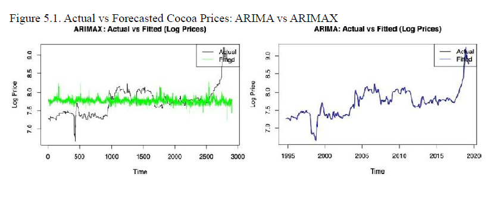
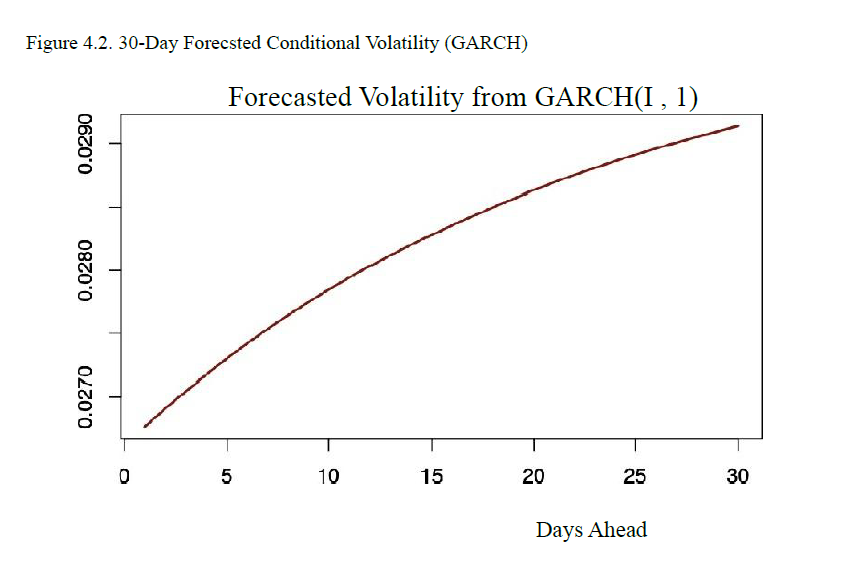

# Cocoa Commodity Price Forecasting & Volatility Analysis 🍫📈

## 📌 Project Overview
This project introduces statistical modeling methods to predict daily cocoa prices based on time series and regression models, focusing on the influence of climatic conditions in Ghana on market behavior. The project employs historical cocoa price data from the International Cocoa Organization and daily climatic data from Ghana. The overall objective is to compare a range of modeling frameworks (ARIMA, ARIMAX, and GARCH) to ascertain which offers the best balance of accuracy, interpretability, and forecasting capability.

## 🛠️ Tech Stack & Methods
* **Language:** R (forecast, rugarch, tseries, dplyr, ggplot2, car)
* **Time Series Modeling:** ARIMA, ARIMAX (with exogenous climate regressors)
* **Volatility Modeling:** GARCH(1,1) with Student's t-distribution
* **Statistical Diagnostics:** Augmented Dickey-Fuller (ADF) test, Ljung-Box test, Variance Inflation Factor (VIF), Cross-Correlation Function (CCF)

## 📊 Key Business Insights & Results

### 1. Climate-Driven Forecasting (ARIMAX vs. ARIMA)
The ARIMAX model significantly outperformed the baseline univariate ARIMA model by incorporating significant weather variables, such as precipitation and temperature. 
* **Model Fit:** The ARIMAX model improved the AIC dramatically (by over 12,500 units), indicating a much stronger explanation of price dynamics.
* **Responsiveness:** As shown below, ARIMAX tracks actual price peaks more closely, capturing the responsiveness to climate conditions that traditional ARIMA misses.

### 2. Market Risk & Volatility (GARCH)
A GARCH(1,1) model was fitted to daily log returns to understand market volatility and conditional variance. The results demonstrated strong volatility persistence ($\alpha + \beta = 0.96$), indicating long memory in variance shocks—a crucial metric for options pricing and risk hedging in commodities.

## 📂 Repository Structure
* data: Contains aggregated historical cocoa prices (ICCO) and Ghana climate data (NOAA).
* cript: Modularized R scripts for reproducibility.
  * 01_data_cleaning_and_eda.R: Data merging, log-transformations, and STL decomposition.
  * 02_arimax_forecasting.R: VIF feature selection and ARIMA/ARIMAX model training.
  * 03_garch_volatility.R: Conditional variance modeling using `rugarch`.
* images: Visualizations of model diagnostics and forecasts, including STL decomposition and residual plots.

## 🚀 How to Run
1. Clone this repository: `git clone https://github.com/NanLi-1217/Cocoa-Price-Volatility-Forecasting.git`
2. Ensure you have R installed along with the required packages: `install.packages(c("tidyverse", "forecast", "rugarch", "tseries", "car", "Metrics"))`
3. Run the scripts in the script folder sequentially.

## 🔮 Future Work
* **Dynamic Climate Inputs:** The current ARIMAX forecast assumes static future climate variables (naive hold approach). Integrating live weather forecast APIs would enhance real-world predictive power.
* **Hybrid Modeling:** Developing a combined ARIMAX-GARCH model to jointly forecast price levels and uncertainty simultaneously.
